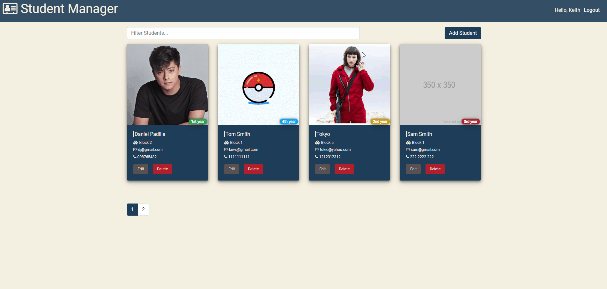

# Student Manager

Users/Teachers can manage and organize their own students info



## Installation

If you want to run to your local make sure you have nodejs on your desktop/laptop.

```
npm start #run client side
npm server #run server side
npm dev #run both client and server side
```

## Features

- Auth Login & Register
- Add Student
- Update Student
- Image base 64 string
- Delete Student
- Pagination

## Tech Used

- MongoDB
- Express
- Reactjs
- Nodejs
- JWT auth
- Context API Hooks
- Axios
- React-Bootstrap
